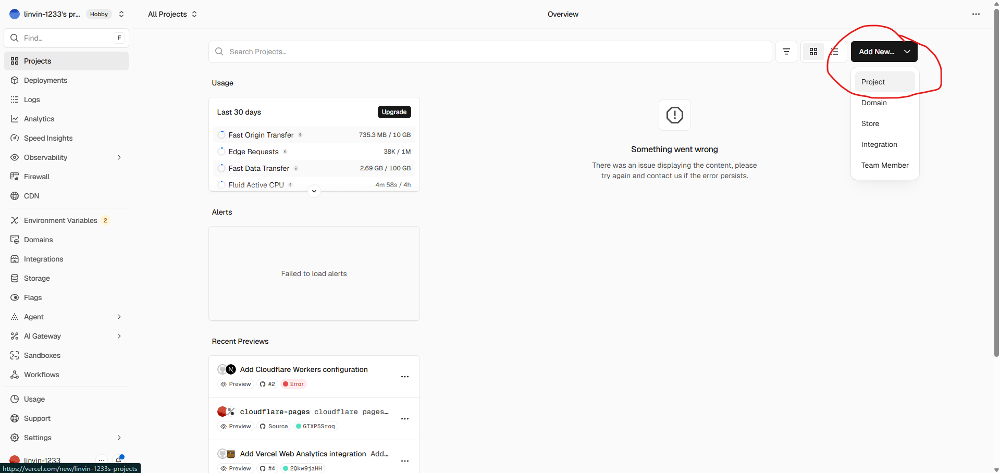
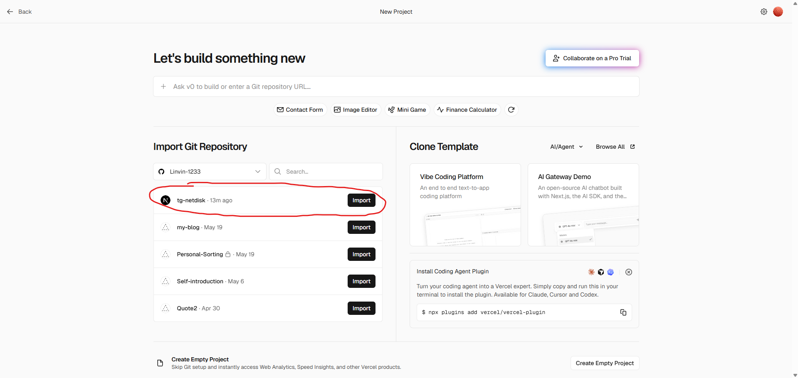
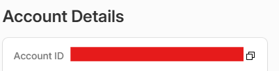
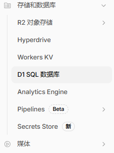
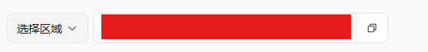
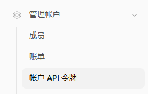
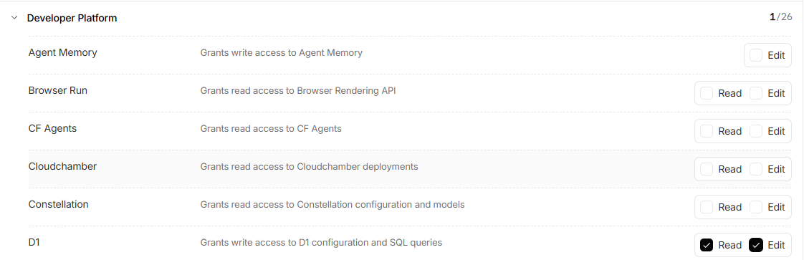
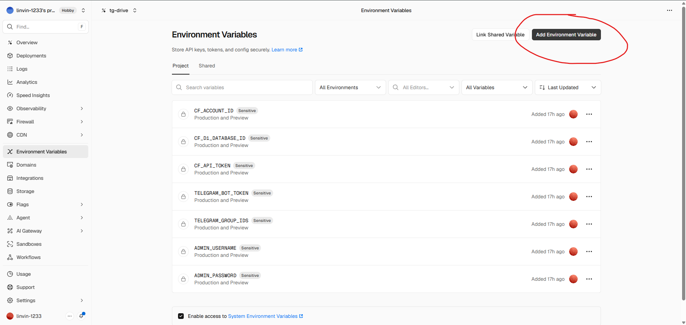

# tg-netdisk

基于telegram bot+next.js的私人/家庭网盘系统  

## 1. 如何使用
1. fork此仓库到你的github上
2. 在vercel后台导入项目
  
  
3. 在telegram的botfather里创建一个你自己的机器人（此处不做演示）
4. 创建你的 Telegram 群组，并在群组内发送消息。
   推荐使用 5 个群组以获得更高上传性能，至少需3个群组。
5. 在浏览器输入https://api.telegram.org/bot你的bot token/getUpdates获得群组id，json如下
    ```json
    "chat": {
              "id": -100.....,   // 你的群组id
              "title": "你的群组",
              "type": "supergroup"
            },
    ```
6. 获得你的cloudflare账户id，这一步只需打开cloudflare，并点开workers 和 pages，找到下图即可
    
7. 创建D1 SQL数据库
    - 请在侧边栏找到D1 SQL数据库 
      
    - 点击创建数据库，地区默认即可（国内请选择亚太地区）
    - 创建好后点击探索数据，并在Query下输入以下代码
    ```sql
    CREATE TABLE files (
    id TEXT PRIMARY KEY,
    name TEXT,
    extension TEXT,
    size INTEGER,
    cdn_urls TEXT,
    folder_id TEXT,
    urls_expired_at INTEGER,
    channel_id TEXT,
    message_id INTEGER
    );
   
    CREATE TABLE folders (
    id TEXT PRIMARY KEY,
    name TEXT NOT NULL,
    parent_id TEXT,
    created_at TIMESTAMP DEFAULT CURRENT_TIMESTAMP, is_locked INTEGER DEFAULT 0, password_hash TEXT)
     ```
   - 完成这一步后，复制你的d1 api  
     
8. 创建你的cloudflare api令牌
    - 请在侧边栏找到账户api令牌 
      
    - 创建一个令牌，无过期时间，权限勾选如图即可 
      
    - 复制保存
9. 将上述操作获取的令牌存入env文件中
    ```
    CF_ACCOUNT_ID=          # 你的cloudflare账户id
    CF_D1_DATABASE_ID=      # 你的D1 SQL数据库id
    CF_API_TOKEN=           # 你的cloudflare api令牌
    TELEGRAM_BOT_TOKEN=     # 你的telegram bot令牌
    TELEGRAM_GROUP_IDS=     # 你的telegram群组id，通过英文逗号分隔。最后一个群组切记不要逗号结尾。如：-100xxx,-150xxx,-123xxx,-502xxx
    ADMIN_USERNAME=         # 登录网盘时的用户名
    ADMIN_PASSWORD=         # 登录网盘时的密码
    ```
10. 输入完后，打开vercel，来到你部署好的项目，点击Environment variables，随后点击Add Environment Variable，将你写好的整个文本复制粘贴进去
11. enjoy it！  

## 开发
在项目控制台中输入以下命令
```bash
git clone https://github.com/Linvin-1233/tg-netdisk.git
```
```bash
cd tg-netdisk
```
```bash
npm install
```

完成后请运行：

```bash
next dev
```
or
```bash
npm run dev
```
在localhost:3000中访问

## 其他
- 如遇到 Bug、功能问题或建议，请提交 Issue。
- 本项目仅提供技术实现与学习用途，请遵守当地法律法规以及 Telegram 平台相关条款。
- 因使用本项目导致的 Telegram Bot、群组、频道或账号限制、封禁等情况，项目开发者不承担责任。
- 用户基于本项目存储、分享、分发的内容及其行为，由用户自行承担责任。
- 本项目不建议用于商业化文件托管服务或大规模公共存储平台，使用时请遵循telegram的使用协议。